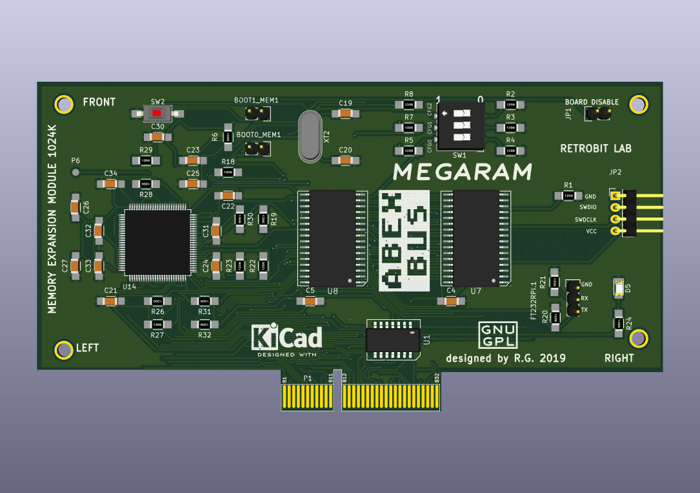

Atari MegaRAM Cart for ABEX
=========================

This is a Atari MegaRAM Cart board, designed for the Atari PBI & ECI Bus EXtender
or ABEX for short.

This Atari MegaRAM is a PortB/PIA emulator which can expand the internal
memory of the Atari, using the memory mapped scheme used in the 80s/90s
like CompyShop, RAMbo and others.

Rendered Images
===============
# Front
# Back
# Overall

Hardware License
================
Copyright (C) 2018/2019 Gianluca Renzi <gianlucarenzi@eurek.it> <icjtqr@gmail.com>

The hardware of this project is released as free/open hardware under the
Creative Commons Attribution Share-Alike license. See `LICENSE.hw` for details.

Firmware License
================
Copyright (C) 2019 Gianluca Renzi <icjtqr@gmail.com>

The microcontroller firmware of this project is released as free software,
under the terms of the GNU General Public License v3, or later.  See
`LICENSE.sw` for details.

Software License
================
The host software (amigafloppy tool) is released as free software, under the
terms of the GNU General Public License v3, or later. See `LICENSE.sw` or licence.txt for
details.
